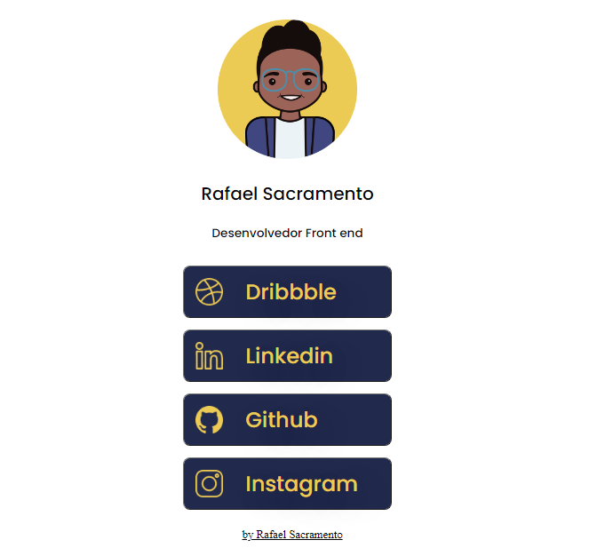

#Meu Linktree V1.0

<h6>O projeto foi desenvolvido para usar no meu instagram  para a galera que quer conhecer/seguir meus estudos por meio do behance, linkedin e o dribbble.
</h6>

<h6>Link do projeto: 
    <a href="https://github.com/RafaelSacramentoo/Meu-Linktree">
        <u>Clique aqui</u>
    </a>
<h6>

<h5> Foi utilizado</h5>
    

    

